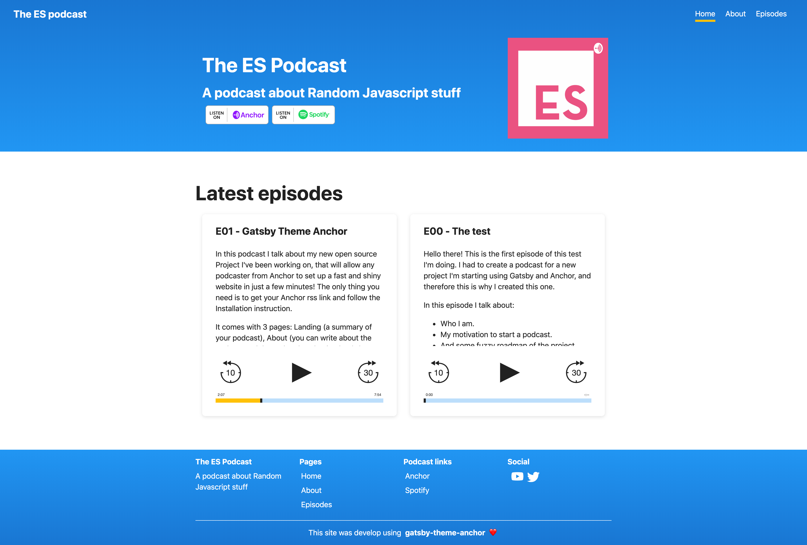

# Customization 🛍

## Changing Podcast 🎙

The first thing you might want to do is change the podcast of the demo to yours. In order to that you need to know your podcast RSS link, which you can find inside the Setting of your podcast. The steps are:

- Open [Anchor](https://anchor.fm/)
- Log in with your account.
- Go to `Update Settings` in the right top corner
- Open `Advanced` section
- Copy the RSS feed value.


Once you have that value, you need to open the `gatsby-config.json` of the project and change the value of `rssValue` provided to `gatsby-theme-anchor`. After that you need to restart the server and you should be able to preview your Podcast episodes.

## Theming 🎨

Luckily Gatsby already thought about this problem and they came out with an idea out of the box, called Component Shadowing, which consist in the developer can override any file inside the theme by creating a file with the same name and location in his project inside a folder with the name of the theme.

Inside this theme all the colors of the application are placed inside a file called `colors.ts` inside the `/src` folder, therefore the only thing you need to do in order to override them is creating a folder called `/gatsby-theme-anchor` inside your `/src` folder and then inside of this one create a file with the name of `colors.ts` (it's important that has that name).

Another thing to consider is that you need to follow the same naming convention inside the theme. An example of a possible `colors.ts` theme can be:

```javascript
export default {
  primaryDark: '#1976D2',
  primary: '#2196F3',
  primaryLight: '#BBDEFB',
  textAlt: '#FFFFFF',
  background: '#FFFFFF',
  accent: '#FFC107',
  text: '#212121',
  textSecondary: '#757575',
};
```

And the Landing Page with the theme applied will look like this:



### Data 📓

As I already mentioned above this project is using Netlify CMS, which is a headless CMS that store all the information of the project inside the same repository. To be more specific all the "project information" is inside `/cms` folder.

The way the data is stored is inside the Markdown file. Therefore you have two possible ways to change your data:

1. Manually change the values inside the `.md` files.
2. Use the CMS to update the information.

I recommend using the CMS for these reasons:

- You can't break the data schema because the CMS won't allow you.
- Some fields have validations (like checking the url has the proper format) that only runs when you use the CMS
- You can see in real time how the page will look like while you are changing your information. This is an amazing feature!


In order to open the CMS you need to just append at the end your url `/admin`. This will open the CMS dashboard where you can see all the entities that you can modify.

## Data Entities

Inside the project there are basically two main data collection, Landing and About. As you might guess they are coupled to the respective screen.

- **Landing**
  - _Heading (optional)_: override podcast title. By default it will take the name from Anchor.
  - _SubHeading (optional)_: set the description of the podcast that will appear in the Hero and in the Footer.
  - _Logo (optional)_: override the podcast logo. By default it will take the logo from Anchor.
  - _Cover (optional)_: you can provide a background for the Hero, this can be a image or you can use an `svg` too. If this is not provide it will show a `linear-gradient` using the theme colors.
  - _Podcast Links_: a list of the platforms where you registered your podcast. They will be displayed inside the Hero and in the Footer.
  - _Social Links_: a list of the all the social web where people can get to know more about your podcast. They will be displayed in the Footer.
- **About**
  - _Description_: the summary of you podcast. You can write this field by using Markdown syntax that will allow you to introduce images or lists if you need it.
  - _List of Authors_: for each of them you can set the name, a small description and an image.

## PWA values 📱

The plugin provides all the required plugin to make your website a PWA and offline support. In order to change the configuration values for the PWA you need to change the `manifest.json` located in the root of your project. Most probably you just to update the `name` and `short_name`, plus with the `background_color` and `theme_color`. You can leave the rest as it's.
